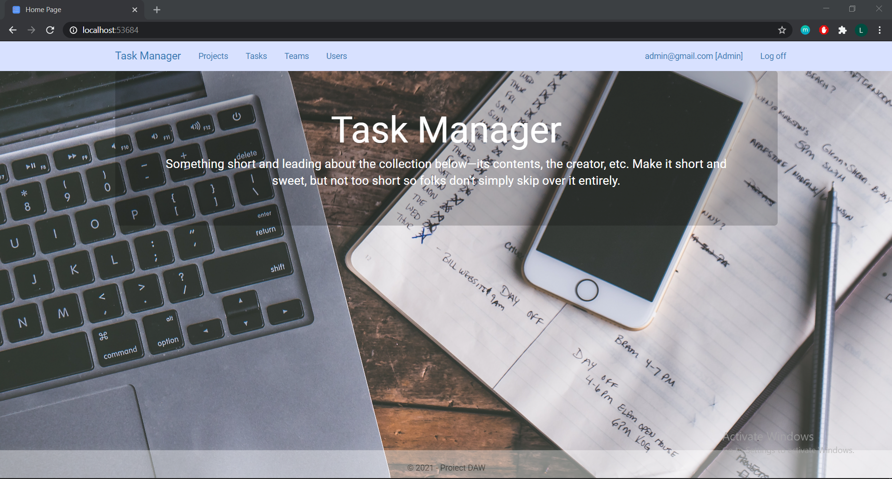

# ASP.NET MVC 5 Web Application 
###### (Developed along with a colleague)

### Description
Web Application for managing tasks. You can create, edit and delete your own teams, projects and tasks.
### Features: 
- [x] _**User Management**_: 4 types of users: unregistered, regular user, organiser and admin
- [x] _**Entity Framework Database**_ for storing data
- [x] _**CRUD Operations**_: Create, Read, Update and Delete operations on teams, projects, tasks and users, restricted by user's role
